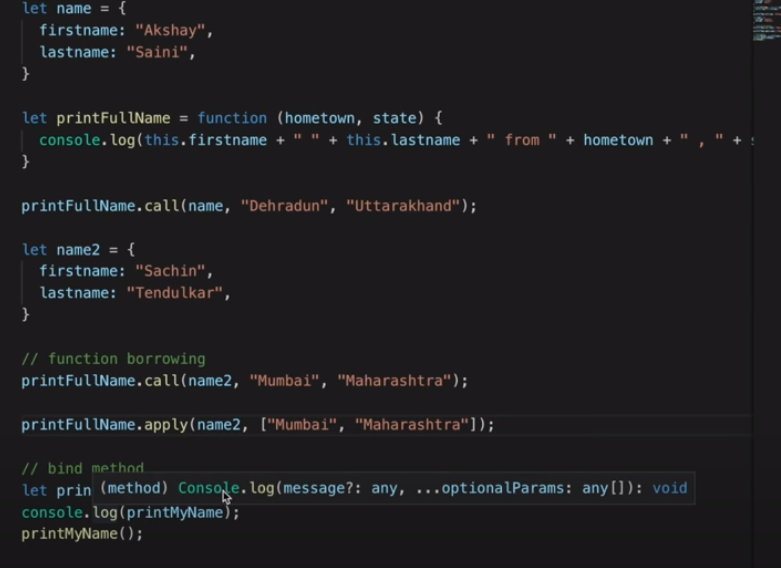

# In  JS, anything that is not primitive types like number/int, string,boolean,undefined,null etc are reference, not values. So arrays, objects are reference.

# local storage is persistent unlike session storage    
-> localStorage.setItem('name','shwethaa')
   sessionStorage.setItem('','')
   localStorage.getItem()
   sessionStorate.removeItem()
# only way to interact with cookies is through document.cookie object

# document.cookie = 'name=shwe; expires=' + new Date(2020, 0, 1).toUTCString()

# in order to never expire time -> just put new Date(9999, 0, 1)

# innerHTML will be rendered on HTML not safe due to XSS attack, instead use innerText

# Every time request is sent to server, cookies are sent automatically, cookie for session is sent along the server. CORs does not prevent we do form action POST.

# Everything in AUTH happens in server

# adding element to a page

# innerText - gives only visible text, textContent - gives all, render HTML directly from JS - innerHTML

https://www.youtube.com/watch?v=y17RuWkWdn8

# static is a default position all html elements have when enter onto the page. So its same as HTML position.

# Relative position behaves exactly like static position, but it can help in changing the position to top,left, bottom and right. when position is selected as either of it, it takes that element out of document flow moves with the direction specified

# Absolute completely removes element from document flow, and everything gets renders as if absolute element didnt exist at all. If you want to stick something in specific position and dont want anything to move around. It says on page doesnt move itself.

# Fixed position is nothing to do with parent position, it fixes itself outside the document flow, 100vh means view height. It moves with the page. 

# Sticky - combination of relative and fixed position
.parent {
   position:relative,
   height: 100vh;
}

.child {
   position:fixed
   top:0
}

# For Accordian - querySelectorAll, addEventListener, nextElementSibling, classList.toggle('active')